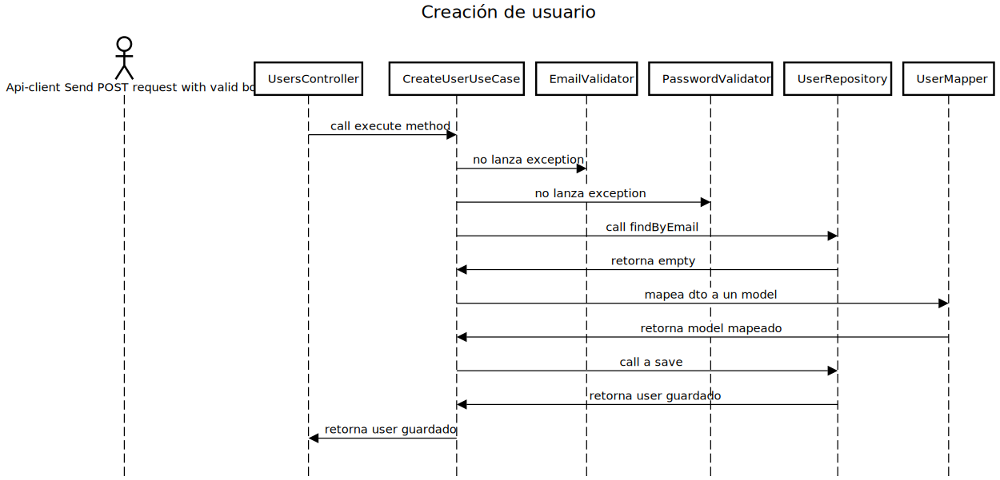
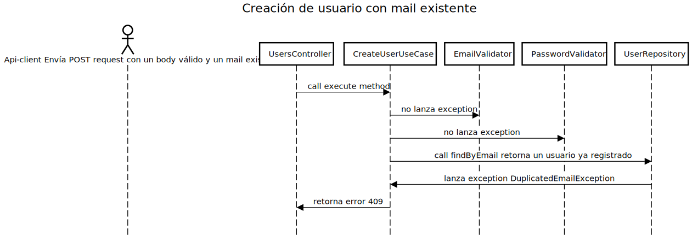

## Requerimiento

Desarrolle una aplicación que exponga una API RESTful de creación de usuarios.
Todos los endpoints deben aceptar y retornar solamente JSON, inclusive al para los mensajes de
error.

## Especificaciones técnicas

La aplicación corre con java 17, este es el único requerimiento para su ejecución

## Build

```shell
./gradlew build
```

## Ejecución

```shell
./gradlew bootRun
```

## Test

```shell
./gradlew test 
```

## Swagger

La documentación swagger está expuesta en http://localhost:8080/swagger-ui/index.html y la documentación en json open api en http://localhost:8080/api-docs

## Forma de testear

Para testear se puede usar estos tres comandos de curl

### Hapy path
```shell

curl --request POST \
  --url http://localhost:8080/users \
  --header 'Content-Type: application/json' \
  --data '{
"name": "Juan Rodriguez",
"email": "juan2@rodriguez.org",
"password": "hunter2",
"phones": [
  {
    "number": "1234567",
    "cityCode": "1",
    "countryCode": "57"
  }]
}
'
```

### Error de mail inválido

```shell
curl --request POST \
  --url http://localhost:8080/users \
  --header 'Content-Type: application/json' \
  --data '{
"name": "Juan Rodriguez",
"email": "juan2@rodriguez",
"password": "hunter2",
"phones": [
  {
    "number": "1234567",
    "cityCode": "1",
    "countryCode": "57"
  }]
}
'
```

### Error de password vacía

```shell
curl --request POST \
  --url http://localhost:8080/users \
  --header 'Content-Type: application/json' \
  --data '{
"name": "Juan Rodriguez",
"email": "juan2@rodriguez.org",
"password": "",
"phones": [
  {
    "number": "1234567",
    "cityCode": "1",
    "countryCode": "57"
  }]
}
'
```

## Diagramas

### Creación de usuario

### Creación de usuario con mail ya registrado



